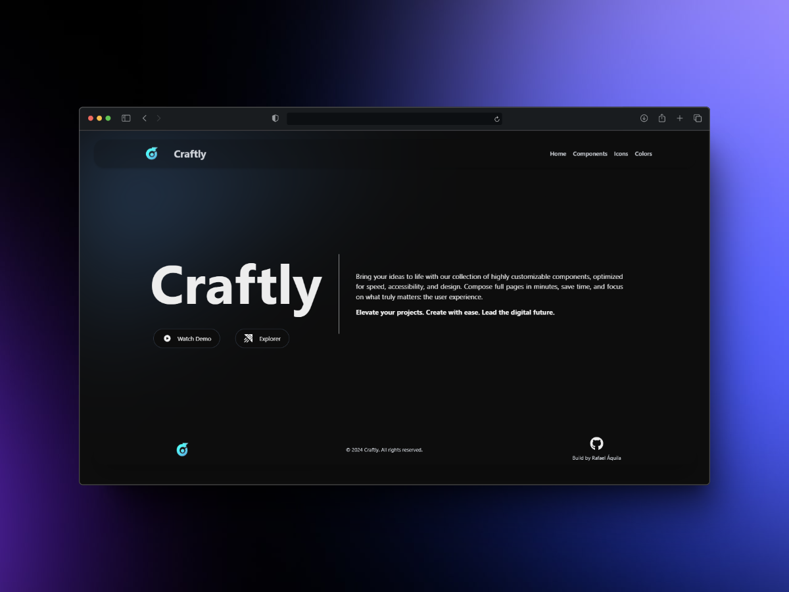

<p align="center">
   
</p>

<h1 align="center">
    <a href="#">Craftly</a>
</h1>

<p align="center">
    Craftly offers a collection of ready-made components, color selection tools, and customizable icons for use on websites.
</p>
<p align="center">
  <a href="https://github.com/rafael-bit/craftly">
  	
  </a>
</p>

# 🚀 How work

Craftly is a website designed to make life easier for developers and designers, offering a collection of ready-made components, color selection tools, and customizable icons for use on websites.

## 👷 Running Locally

#### Clone the repository

```bash
git clone https://github.com/rafael-bit/craftly
```

#### Install dependencies and run the application in development mode

```bash
yarn
yarn dev
```

Open this adress in your navegation: [Craftly](http://craftlys.vercel.app/)

# 💻 Technologies

[Next.js](https://nextjs.org/) and [Tailwind CSS](https://tailwindcss.com/).

#  🚩 Bugs

Feel free to **report a new issue** with an appropriate title and description.

# 💡 Autor

- Rafael Áquila ([@rafael-bit](https://github.com/rafael-bit))

# 🔧 Contributing

Check the page of [contribution](https://github.com/rafael-bit/craftly/) to see the best places to report issues, start discussions, and start contributing.